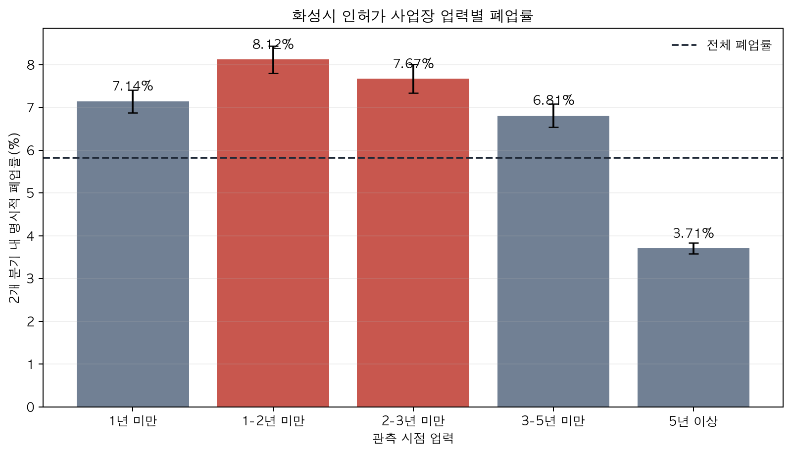

# 업력별 폐업률 분석

작성일: 2026-08-18  
실행 스크립트: `ai/analyze_tenure.py`

## 결론

- 가장 높은 구간은 **1-2년 미만(4-7분기)**로, 이후 2개 분기 내 명시적 폐업률은 **8.12%**이다.
- 인허가 종류와 관측 분기 구성을 보정해도 표준화 폐업률은 8.03%로, 전체 5.82% 대비 **1.38배**다.
- 사전에 고정한 `사업장 100개 이상 + 전체 대비 위험비 1.2 이상` 기준을 통과한 구간은 **1-2년 미만, 2-3년 미만**이다.
- 실행 목록의 업력 필터는 **1-3년 미만(4-11분기)**으로 확정한다. 1년 미만과 3년 이상은 업력만으로 우선 선정하지 않는다.
- **U자형은 나타나지 않았다.** 5년 이상 구간은 3.71%로 가장 낮았다. 초장기 업체가 다시 위험해진다는 주장은 하지 않는다.

## 결과표

| 업력 구간 | 관측건 | 사업장수 | 원폐업률 | 95% CI | 표준화 폐업률 | 보정 위험비 | 안내 대상 권고 |
|---|---:|---:|---:|---:|---:|---:|:---:|
| 1년 미만 | 56,766 | 17,212 | 7.14% | 6.87-7.41% | 6.71% | 1.15 | 아니오 |
| 1-2년 미만 | 49,284 | 14,828 | 8.12% | 7.80-8.43% | 8.03% | 1.38 | 예 |
| 2-3년 미만 | 40,858 | 12,385 | 7.67% | 7.33-8.00% | 7.54% | 1.29 | 예 |
| 3-5년 미만 | 60,909 | 11,222 | 6.81% | 6.54-7.08% | 6.67% | 1.15 | 아니오 |
| 5년 이상 | 152,931 | 12,298 | 3.71% | 3.57-3.84% | 3.82% | 0.66 | 아니오 |

## 분석 정의

- 데이터: 화성시 인허가 CSV 12종의 `인허가일자`, `폐업일자`.
- 관측 시점: 2020Q4~2025Q2 분기말 19개. 원시 데이터는 21개 분기이지만 +2분기 결과가 필요해 마지막 2개 분기는 기준 시점에서 제외했다.
- 모수: 해당 분기말에 영업 중이며 인허가일자가 유효한 사업장.
- 사건: 기준 분기말 이후 2개 분기 말까지 `폐업일자`가 명시된 경우. 휴업일자는 사건으로 세지 않았다.
- 단위: 사업장-기준분기 관측건. 같은 사업장의 반복 관측을 감안해 95% 신뢰구간은 사업장 클러스터 샌드위치로 보정했다.
- 표준화: 업력 구간별 인허가 종류×관측 분기 구성 차이를 제거하기 위해 전체 표본의 구성비를 공통 가중치로 적용했다. 안내 대상 권고는 이 보정값을 사용했다.
- 표본: 30,698개 사업장, 360,748건 관측.

## 제한과 사용 범위

1. 이 결과는 인허가 데이터가 있는 12종에 대한 결과다. 화성시 74개 중분류 전체의 인과법칙으로 일반화하지 않는다. 또한 표본의 79.9%가 식품 관련 인허가여서, 인허가 종류 구성을 표준화해 권고 기준을 정했다.
2. 5년 이상 사업장의 낮은 폐업률은 오래 살아남은 업체만 위험집단에 남는 생존자 효과를 포함한다.
3. 이 분석은 **안내 대상을 줄이는 집단 기준**이지, 개별 점포의 폐업 예측이 아니다.
4. 현재 `store_train_table.csv` 업력은 주소 기반 추정치이므로 이 결과를 점포 명단에 적용하려면 상호명+주소+업종을 이용한 인허가 매칭 고도화가 먼저 필요하다.

## 발표용 한 문장

> 화성시 인허가 사업장 30,698개를 분석한 결과, 개업 1-2년 미만 구간의 6개월 내 명시적 폐업률이 8.12%로 가장 높았고, 업종·시점을 보정해도 1-3년 미만 구간이 전체보다 1.2배 이상 높아 우선 안내 대상으로 좁혔습니다.
